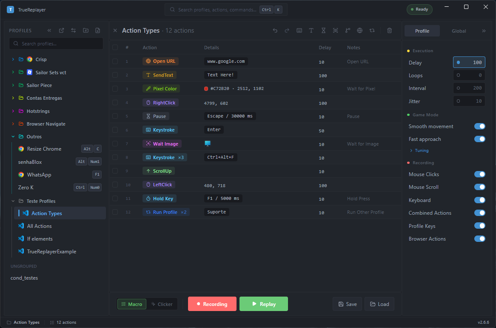
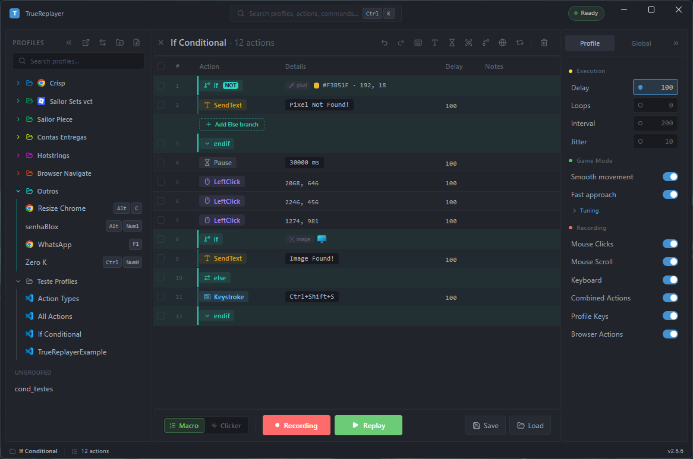
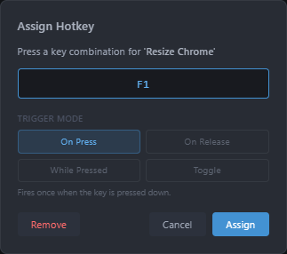
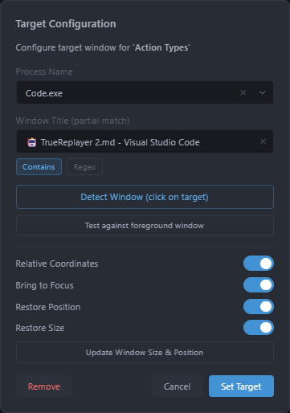
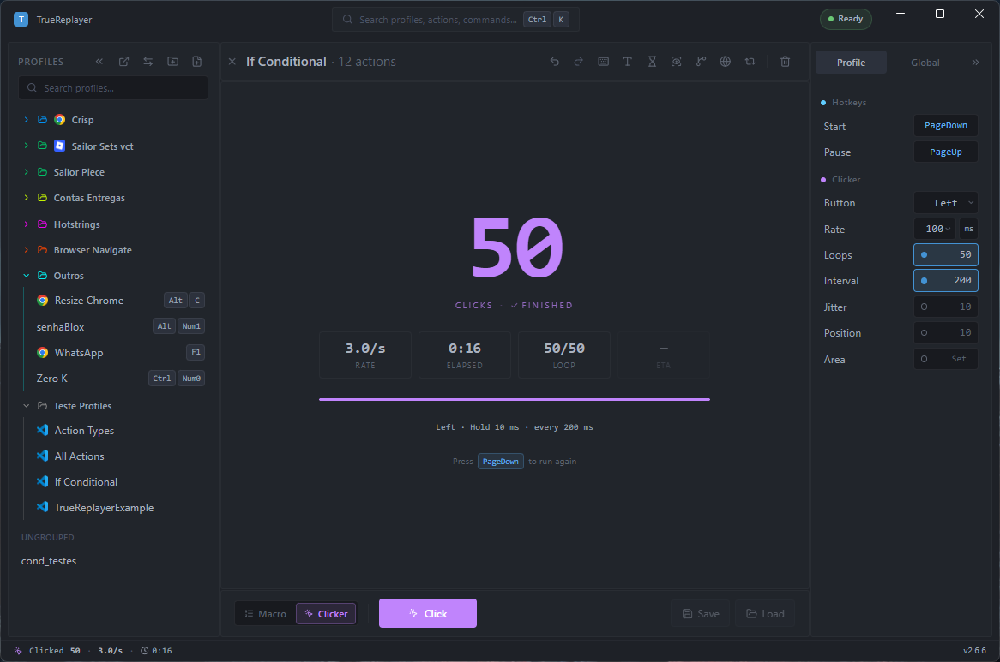
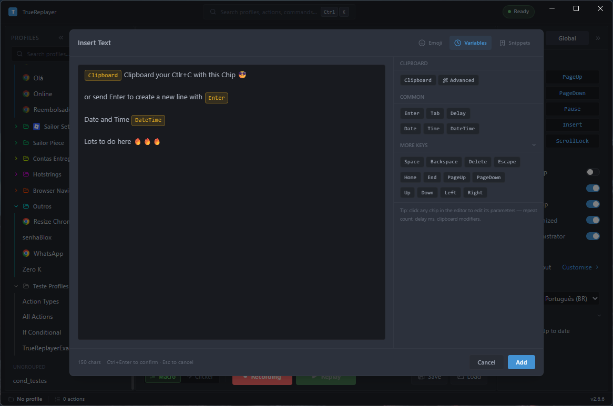
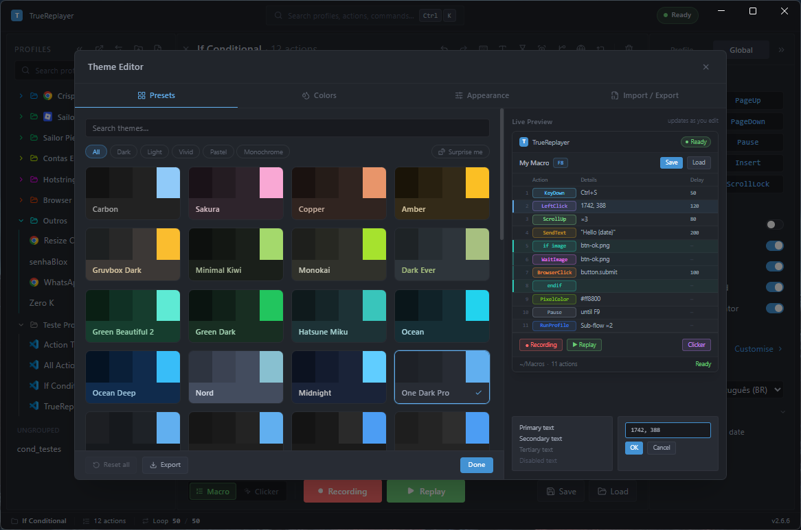

<div align="center">

# TrueReplayer — Guia do Usuário

**Português (BR)** · [English](GUIDE.en.md) &nbsp;·&nbsp; [← Voltar ao README](../README.md)

</div>

A referência completa de tudo o que o TrueReplayer pode fazer. Primeira vez por aqui? Comece pelo [Início rápido](../README.md#início-rápido) no README e depois volte para os detalhes.

## Conteúdo

- [Conceitos básicos](#conceitos-básicos)
- [Receitas — aprenda fazendo](#receitas--aprenda-fazendo)
- [Recording](#recording)
- [Reprodução e configurações de execução](#reprodução-e-configurações-de-execução)
- [A grade de ações](#a-grade-de-ações)
- [Referência de ações](#referência-de-ações)
- [Blocos condicionais (If / Else / EndIf)](#blocos-condicionais-if--else--endif)
- [Perfis e pastas](#perfis-e-pastas)
- [Hotkeys e hotstrings](#hotkeys-e-hotstrings)
- [Automação (disparo sem hotkey)](#automação-disparo-sem-hotkey)
- [Remaps de tecla](#remaps-de-tecla)
- [Alvo de janela e coordenadas relativas](#alvo-de-janela-e-coordenadas-relativas)
- [Automação multi-janela (Activate Window)](#automação-multi-janela-activate-window)
- [Clicker mode (auto-clicker)](#clicker-mode-auto-clicker)
- [Game mode](#game-mode)
- [Send Text](#send-text)
- [Variáveis, slots e prompts](#variáveis-slots-e-prompts)
- [Data Loop](#data-loop)
- [Automação de navegador](#automação-de-navegador)
- [Temas e aparência](#temas-e-aparência)
- [Referência de configurações](#referência-de-configurações)
- [Onde seus dados ficam](#onde-seus-dados-ficam)
- [Solução de problemas](#solução-de-problemas)

---

## Conceitos básicos

- **Perfil (profile)** — uma única macro: uma lista ordenada de ações mais suas próprias configurações (delays, loops, alvo de janela, etc.). Salvo como um arquivo `.json`.
- **Ação (action)** — um passo dentro de um perfil (um clique, uma tecla, uma pausa, um *If*, …). Mostrado como uma linha na grade.
- **Pasta (folder)** — um grupo organizacional e colorido de perfis. Um perfil fica em no máximo uma pasta.
- **Macro mode vs Clicker mode** — o *Macro mode* grava e reproduz listas de ações; o *Clicker mode* é um auto-clicker dedicado. Alterne com **`ScrollLock`** ou com o botão Macro/Clicker na parte inferior.

---

## Receitas — aprenda fazendo

São catorze tarefas curtas e completas, da mais fácil para a mais difícil. Cada uma mostra exatamente onde clicar, e todas são trabalhos de verdade que alguém automatiza todo dia. Faça duas ou três e você já sabe usar o app.

A maioria das macros úteis é **minúscula** — uma ou duas ações. Não ache que você precisa gravar algo longo.

### 1. Uma resposta pronta que você digita em qualquer lugar

**O resultado:** você digita `.cp` em qualquer caixa de chat e ela vira uma resposta completa, já enviada.

1. Barra de ferramentas → **Send Text**. Escreva a mensagem.
2. Na paleta de tokens à direita, clique em **Enter** para colocar `{enter}` no fim do texto — é isso que envia a mensagem.
3. **`Ctrl+Enter`** para confirmar e depois **Save** no perfil.
4. Botão direito no perfil → **Assign hotstring…** → digite `.cp` → **Assign**.

*Na prática:* um atendente cria uma macro dessas para cada resposta que ele repete o dia todo — `.cp` para o código de desconto, `/ve` para "já está a caminho", `/pg` para o link de pagamento. Uma ação em cada uma.

### 2. Coloque o que você copiou dentro da resposta

**O resultado:** você copia o nome do cliente, aperta uma tecla e o app digita um passo a passo inteiro já com o nome dele no meio do texto.

1. No **Send Text**, escreva seu texto e ponha `{clipboard}` onde entra o valor copiado.
2. Precisa só de um pedaço? Use modificadores: `{clipboard:trim}` (tira espaços e quebras de linha sobrando), `{clipboard:line:3}` (só a terceira linha), `{clipboard:upper}`.

O que você tinha copiado volta para a área de transferência logo depois, então nada se perde.

*Na prática:* copie de uma vez um cadastro inteiro, com várias linhas, e reescreva só as linhas que interessam com `{clipboard:line:1}` e `{clipboard:line:3}`.

### 3. Carimbe a hora e feche o chamado

**O resultado:** uma tecla escreve a mensagem de "entregue" já com a data de hoje e, logo depois, aciona o atalho que marca o chamado como resolvido no seu sistema de atendimento.

1. **Send Text** → sua mensagem, depois `Finalizado em {datetime}`, depois `{enter}`.
2. Barra de ferramentas → **Send Keystroke** → pressione `Ctrl+Alt+R` (o atalho que o seu app usa) → **Add**.
3. Botão direito no perfil → **Assign hotkey…** → pressione `F1` → **Assign**.

Duas ações, e o fechamento inteiro vira um toque de tecla.

### 4. Me pergunte um valor na hora de rodar

**O resultado:** a macro para, faz uma pergunta e digita a sua resposta no lugar certo.

1. No **Send Text**, digite `{input:Número do pedido}` onde a resposta deve entrar.
2. Quer uma lista de opções em vez de uma caixa de texto? Use `{input:Prioridade|menu:Baixa,Média,Alta}`.

A pergunta aparece **uma vez a cada execução**: se você usar `{input:Número do pedido}` de novo mais para frente, ele repete a mesma resposta sem perguntar outra vez.

### 5. Faça funcionar só em um app

**O resultado:** a hotkey da macro dispara só quando a janela certa está na frente, e os cliques acompanham a janela quando ela se move.

1. Botão direito no perfil → **Window target…**.
2. Clique em **Detect Window (click on target)** e depois clique na janela de verdade — o processo e o título se preenchem sozinhos.
3. Clique em **Test front window** para confirmar que aparece *Matches*.
4. Ligue **Relative Coordinates** para os cliques serem guardados em relação ao canto da janela.
5. Se a macro já estava gravada, aceite o aviso **Convert to Relative**.

> Sem isso, basta alguém mover a janela 20 px para todos os cliques caírem no lugar errado.

### 6. Espere a tela em vez de chutar

**O resultado:** a macro espera o botão realmente aparecer, em vez de clicar num ponto que ainda não está pronto.

1. Barra de ferramentas → **Wait for Image / Pixel** → **Wait for Image**.
2. A tela congela — arraste um retângulo em volta do botão (ou ícone) que a macro vai ficar esperando aparecer.
3. No painel que abre, clique em **Test match** para conferir com a tela ao vivo. Procure uma correspondência folgada e deixe a confiança por volta de **85%**.

> **Nunca coloque a confiança em 100%.** Uma tela viva nunca fica idêntica, pixel por pixel, à imagem que você recortou — então a macro nunca considera que achou e acaba parando por esgotar o tempo.

*Na prática:* é isso que conserta o "funciona quando a internet está rápida e quebra quando está lenta".

### 7. Faça o clique opcional só quando ele aparecer

**O resultado:** a macro clica na janelinha de confirmação *se* ela aparecer, e segue em frente normalmente quando ela não aparece.

1. Barra de ferramentas → **Conditional** → **Pixel Color Match**.
2. Escolha um ponto dentro da cor sólida do botão de confirmar.
3. Selecione a linha **If** e coloque **Wait for condition** em `5000` (são milissegundos, ou seja, 5 segundos) — agora ele fica verificando por até 5 segundos antes de decidir.
4. Ponha o clique *entre* **If** e **EndIf**.

Cor funciona melhor que imagem quando dois estados só se diferenciam pela cor — um botão verde ligado contra um cinza desligado.

### 8. Guarde um valor entre os passos

**O resultado:** você captura ou monta um valor uma vez só e usa ele de novo em qualquer passo seguinte da macro.

1. Barra de ferramentas → **Set Variable**. Dê um **Name** (ex.: `cliente`) e um **Value** — o valor pode conter tokens, como `{clipboard:trim}`.
2. Em qualquer lugar depois, digite `{var:cliente}`.

As variáveis são apagadas no começo de cada execução. Coloque o modo em **Cycle** e o valor vira uma lista: cada execução pega a *próxima* linha e, quando chega na última, volta para a primeira.

### 9. Junte vários valores e cole todos depois

**O resultado:** você pega três coisas de três lugares diferentes e depois preenche um formulário com todas.

1. Settings → **Keys** → **Hotkeys** → **Capture Slot** → pressione uma combinação.
2. Selecione um texto em qualquer lugar e aperte essa combinação. Repita: as capturas vão caindo nos slots 1, 2, 3… até o 9 e, depois do 9, voltam para o 1.
3. Num perfil, digite `{clip:1}`, `{clip:2}`, `{clip:3}` onde cada um entra.

Os slots continuam guardados de uma execução para outra, ao contrário das variáveis. Para capturar *durante* uma macro, em vez de manualmente, use a ação **Copy to Slot** com um slot nomeado e leia de volta com `{clip:name}`.

### 10. Digite o próximo item de uma lista a cada toque

**O resultado:** uma hotkey que percorre uma lista — um item diferente a cada vez que você aperta.

1. Barra de ferramentas → **Data Loop** → **Paste / bulk edit…** → cole sua lista do Excel → **Replace table**.
2. Deixe **Loop over data** desligado.
3. No **Send Text**, digite `{row:col1}` (ou o nome da sua coluna) e `{enter}`.

Cada toque usa a próxima linha e avança; no fim ele volta para o topo e toca um som. Botão direito numa linha → **Reset row position** para recomeçar.

### 11. Troque 20 passos repetidos por um loop

**O resultado:** uma macro pequena mais uma tabela, em vez das mesmas cinco ações copiadas e coladas dezessete vezes.

1. Monte a macro **uma vez**, para um único item.
2. Barra de ferramentas → **Data Loop** → cole uma tabela com uma coluna por valor que muda (ex.: `item` e `qtd`).
3. Troque os valores fixos das suas ações por `{row:item}` e `{row:qtd}`.
4. Ligue **Loop over data** — agora a macro roda uma vez por linha.
5. Coloque **On row error** em **Skip row** para que uma linha com problema não interrompa as outras — ele pula essa linha e continua.

*Na prática:* uma macro de 87 ações que carrega 17 itens num formulário vira 5 ações e uma tabela de 17 linhas — e adicionar um item é uma linha nova, não uma regravação.

### 12. Reaproveite um mesmo final em várias macros

**O resultado:** vinte macros que terminam com os mesmos passos de confirmação — corrigidos num lugar só.

1. Ponha os passos comuns num perfil só deles (ex.: `Confirmar`).
2. Em cada macro, barra de ferramentas → **Run Profile** → escolha `Confirmar` → **Add**.

Conserte o fluxo de confirmação uma vez e as vinte melhoram. Um perfil pode chamar outro, que chama outro — mas depois de 5 níveis o app bloqueia sozinho, para não entrar em loop infinito.

> Os **Loops** do próprio sub-perfil são ignorados — só vale a contagem **Repeat** do diálogo.

### 13. Clique num site pelo nome, não pela posição

**O resultado:** passos no navegador que continuam funcionando mesmo quando os elementos da página mudam de lugar.

1. Instale a extensão do Chrome (veja [Automação de navegador](#automação-de-navegador)) e garanta que ela está conectada.
2. Barra de ferramentas → **Browser** → **Browser Click**, e escolha o elemento na página.
3. Prefira usar o **texto** visível (ex.: `text=Enviar`) quando o layout muda com frequência.

*Na prática:* três cliques identificados por seletor movem uma conversa de atendimento para outra caixa de entrada — nenhum deles usa coordenada, então tudo continua funcionando mesmo se a janela mudar de tamanho.

### 14. Rode sem apertar nada

**O resultado:** a macro dispara sozinha — a cada N minutos, num horário definido, ou quando algo aparece na tela.

1. Settings → **App** → **Automation** → **Manage ›**.
2. **+ Add automation** → escolha o perfil.
3. Escolha o **Trigger**: **Interval**, **Schedule** ou **Condition**.
4. **Save**, e depois ligue a chave **Armed** da linha na lista.

> Salvar não é armar. Uma automação configurada não faz nada até você armá-la — essa chave é a que todo mundo esquece.

Ligue **Run on Startup** + **Startup Minimized** (Settings → App → Startup) e o TrueReplayer vira um ajudante que fica rodando sozinho, escondido na bandeja do sistema (ao lado do relógio).

---

## Recording

1. Garanta que um perfil esteja ativo (ou inicie um novo).
2. Pressione **`Ctrl+PageUp`** (ou clique em **Recording**). O selo e o botão Recording começam a brilhar para você não perder que a captura está ativa.
3. Faça suas ações — cliques, digitação, rolagem.
4. Pressione **`Ctrl+PageUp`** novamente para parar.

**Onde os novos passos vão parar:** se você tiver linhas **selecionadas**, a gravação insere **antes** da primeira linha selecionada; **sem seleção**, ela **acrescenta** ao final. Limpe a seleção para acrescentar ao final.

### Filtros de captura (Settings → Recording)

| Opção | Efeito |
| --- | --- |
| **Mouse Clicks** | Captura cliques esquerdo / direito / do meio e cliques duplos. |
| **Mouse Scroll** | Captura rolagem da roda do mouse para cima/baixo. |
| **Keyboard** | Captura pressionamentos de teclas e modificadores. |
| **Combined Actions** | **On** → a entrada é mesclada em linhas únicas (ex.: `Ctrl+C` = uma linha *Keystroke*). **Off** → gravado como linhas `KeyDown`/`KeyUp` (e `LeftClickDown`/`LeftClickUp`) separadas — necessário para arrastar com o mouse ou para segurar uma tecla enquanto faz outras coisas. |

Todos os quatro vêm como **On** por padrão.

---

## Reprodução e configurações de execução

Pressione **`Ctrl+PageDown`** (ou clique em **Replay**) para executar o perfil ativo; pressione novamente ou clique em **Stop** para interromper imediatamente (qualquer botão pressionado é solto). Durante a reprodução, o selo **"Replaying"** e o botão **Stop** pulsam para deixar o estado em execução óbvio, e a barra de status mostra o progresso, o tempo decorrido e o contador de loops.

As configurações de **Execution** (aba Settings → Profile) controlam o tempo:

| Configuração | O que faz | Padrão |
| --- | --- | --- |
| **Delay** | Um atraso fixo (ms) aplicado antes de cada ação, substituindo o tempo gravado. | 100 ms (ligado) |
| **Loops** | Quantas vezes repetir a macro inteira. **0 = infinito.** | 1 |
| **Interval** | Pausa (ms) entre as iterações do loop. | desligado |
| **Jitter** | Variação aleatória de ± % aplicada a cada delay, para que a reprodução não fique perfeitamente regular. | desligado |

---

## A grade de ações

A tabela central lista todas as ações do perfil. Colunas: **caixa de seleção · Action (pílula colorida) · Details · Delay · Notes**.

<p align="center">
  <br>
  <sub><i>Perfis &amp; pastas à esquerda, a grade de ações no centro, configurações à direita.</i></sub>
</p>

- **Selecionar** — clique numa linha (única), `Ctrl+Click` (alternar), `Shift+Click` (intervalo), ou use as caixas de seleção.
- **Editar na própria linha** — clique numa célula para editar **Delay**, **Notes**, **coordenadas** (`x, y` para linhas de mouse — os separadores podem ser vírgula/ponto e vírgula/espaço) ou a **Key** (linhas de teclado capturam a próxima tecla que você pressionar). Confirme com **Enter/Tab**, cancele com **Esc**.
- **Reordenar** — arraste uma linha, ou selecione e pressione **`Alt+↑` / `Alt+↓`**.
- **Clique com o botão direito** numa linha para **Duplicate**, **Delete**, **Edit** e mais. (O **Else** não fica aqui — ele entra pela linha tracejada **+ Add Else branch**, dentro do bloco If.)
- **Pular** — desmarcar uma linha a mantém na lista, mas ela não roda durante a reprodução.
- **Barra em massa** — quando várias linhas estão selecionadas, aparece uma barra com **Set delay**, **Set X / Set Y** (um deslocamento `+10` / `-5` ajusta cada uma; um número simples define todas), **Set notes**, **Move ↑/↓**, **Skip**, **Delete**.
- **Painel Sheet** — clique com o botão direito → Edit (ou abra o Sheet) para um formulário completo com todos os campos da linha selecionada.

> **Nota:** *Else / EndIf* são marcadores de salto puros — a célula Delay deles fica em branco e não é editável, e um "set delay" em massa as ignora. O **If** de abertura *aceita* delay: é uma **espera pré-sondagem** aplicada antes de checar a condição, para que uma imagem/pixel que demora a aparecer não seja lida como "falsa" e o bloco pulado por engano.

---

## Referência de ações

| Ação | O que faz |
| --- | --- |
| **Left / Right / Middle Click** | Um único clique daquele botão em `(x, y)`. |
| **Double Click** | Dois cliques esquerdos no mesmo ponto, cronometrados abaixo do limiar de clique duplo do sistema para que os aplicativos os tratem como um clique duplo real. |
| **Keystroke** | Pressiona uma tecla ou combinação uma vez — ou **N vezes** com um intervalo configurável. |
| **Hold Key** | Mantém uma única tecla pressionada por uma duração definida (padrão 1000 ms). Modificadores são descartados. |
| **Key Down / Key Up** | Um pressionamento ou liberação isolado — para segurar teclas e arrastar, em que o down/up precisa ser separado. |
| **Scroll Up / Down** | Um passo da roda do mouse na posição do cursor. |
| **Send Text** | Injeta texto (com tokens, snippets, transformações de clipboard) — veja [Send Text](#send-text). |
| **Set Variable** | Guarda um valor com nome pelo resto da execução, lido de volta com `{var:name}`. No modo *Cycle* o valor é uma lista e cada execução pega a próxima linha — veja [Variáveis, slots e prompts](#variáveis-slots-e-prompts). |
| **Copy to Slot** | Copia o que estiver **selecionado agora** no app em foco para um slot de clipboard nomeado, lido de volta com `{clip:name}`. |
| **Pause** | Interrompe até que uma **hotkey de retomada** seja pressionada ou um **timeout** expire (o que vier primeiro). Precisa de pelo menos um dos dois. |
| **Wait Image** | Bloqueia até que uma imagem de referência apareça na tela (opcionalmente dentro de uma região de busca recortada; confiança padrão ≈ 85%). |
| **Wait Pixel Color** | Bloqueia até que o pixel em `(x, y)` corresponda a uma cor hex alvo (dentro da tolerância). |
| **Run Profile** | Executa outro perfil como um subpasso — opcionalmente um número definido de vezes. Ciclos e cadeias com mais de 5 níveis de profundidade são bloqueados automaticamente. |
| **Activate Window** | Age sobre a janela de outro app no meio da execução: **Activate** (trazer para a frente — abrindo o app antes, se preciso), **Maximize**, **Minimize** ou **Close**. O *Activate* muda só o alvo de foco do SO, nunca o contexto de coordenadas. Veja [Automação multi-janela](#automação-multi-janela-activate-window). |
| **If / Else / EndIf** | Ramificação condicional — veja [Blocos condicionais](#blocos-condicionais-if--else--endif). |
| **Browser actions** | Click / Type / Navigate / Wait element / Assert element / Select option no Chrome — veja [Automação de navegador](#automação-de-navegador). |

Insira ações pela **barra de ferramentas** (Send Keystroke, Send Text, Set Variable, Copy to Slot, Pause, Wait, Conditional, Browser, Run Profile, Activate Window, Data Loop). A maioria das ações abre um pequeno diálogo para configurá-las; clique na célula Details de uma ação depois para editá-la.

> **Dica — diferencie por cor, não por confiança.** O match de imagem compara a referência inteira, ótimo para forma/texto, mas é grosseiro para distinguir dois estados que diferem só na **cor** (ex.: um botão habilitado *verde* vs desabilitado *cinza*). Para isso use **Wait Pixel Color** (ou um **If** em *Pixel Color Match*): amostre um ponto no preenchimento sólido e compare a cor dentro de uma tolerância. E não use **confiança em 100%** — uma tela viva nunca fica idêntica, pixel por pixel, à referência, então uma exigência de 100% nunca é atendida e a macro para por esgotar o tempo (internamente o valor é limitado logo abaixo de 100%).

---

## Blocos condicionais (If / Else / EndIf)

Faça uma macro reagir ao que está na tela.

<p align="center">
  <br>
  <sub><i>Uma verificação de pixel negada (<code>if NOT</code>) e uma verificação de imagem com ramo <code>else</code>.</i></sub>
</p>

- Um **If** executa uma **sondagem** — uma checagem rápida de sim/não. Escolha o tipo no menu **Conditional** da barra de ferramentas quando você insere o bloco:

| Condição | Verdadeiro quando |
| --- | --- |
| **Image Found** | Uma imagem de referência está visível na tela. |
| **Pixel Color Match** | O pixel em `(x, y)` corresponde a uma cor (dentro da tolerância). |
| **Window Open** | Existe uma janela que corresponde a um processo/título — opcionalmente só quando ela está em primeiro plano. |
| **Clipboard** | O texto do clipboard corresponde (Contains / Exact / Regex / Empty). |
| **Browser Element** | Um elemento no Chrome está presente, visível ou habilitado. |
| **Random** | Um sorteio cai abaixo de N% — para macros que não devem parecer perfeitamente regulares. |
| **Variable** | Um `{var:name}` compara verdadeiro contra um valor (igual, contém, maior que, …). |
| **Process Running** | Um processo com aquele nome está rodando. |
| **File Exists** | Um arquivo ou pasta existe no disco. |
| **Time** | O relógio está dentro de uma janela de início–fim, nos dias da semana que você escolher. |

- Se a sondagem for **verdadeira**, as ações entre **If** e **Else/EndIf** rodam; se **falsa**, a execução salta para a ramificação **Else** (se houver) ou para depois do **EndIf**.
- **Negate (IFNOT)** inverte o teste — a ramificação *verdadeira* roda quando a sondagem **falha**.
- **Wait for condition** (opcional) — por padrão um **If** checa uma vez e ramifica na hora. Defina um valor de *Wait for condition* (ms) e ele fica checando durante esse tempo até a condição ficar verdadeira antes de decidir: satisfez a tempo → ramo **verdadeiro**; o tempo acabou → **Else / falso**. Ótimo para *"espere até 3 s o botão habilitar, senão siga um plano B."* `0` = instantâneo (o padrão).
- Blocos podem ser **aninhados** — cada nível de aninhamento aparece na sua própria cor (com trilhos de escopo correspondentes) para manter condicionais profundas legíveis. Para criar um bloco aninhado, selecione uma linha **dentro** de um bloco existente e use **Insert Conditional**. Adicione um **Else** pela linha tracejada **+ Add Else branch**, dentro do bloco. A estrutura é validada e reparada automaticamente ao carregar (marcadores órfãos removidos, `EndIf` ausente adicionado).

**Editando o conteúdo de um bloco** — ações *dentro* de um bloco são editadas de forma granular; uma operação só engloba o **bloco inteiro** quando a seleção inclui um marcador (*If / Else / EndIf*), para que marcadores nunca fiquem órfãos:
- **Arraste** uma ou mais ações do corpo livremente **para dentro ou para fora** de um bloco (uma, várias, até não-contíguas).
- **Delete** linhas do corpo e o bloco permanece — selecione a linha **If** para deletar o bloco inteiro.
- **Reordene** com **Move ↑/↓** ou **`Alt+↑` / `Alt+↓`**: uma seleção só de corpo move sozinha; uma seleção que toca um marcador leva o bloco inteiro.
- **Duplique** um **If** para copiar o bloco inteiro como irmão.
- Arrastar o próprio **If** (ou qualquer seleção que inclua um marcador) sempre move o bloco inteiro junto.

### Exemplo completo — a janelinha que só aparece às vezes

**A situação.** Toda vez que você fecha um atendimento, o sistema *às vezes* abre um aviso de "Tem certeza?" — e às vezes não. Quando aparece, a macro digita por cima da janelinha e estraga tudo; quando não aparece, botar uma pausa fixa de 3 segundos só faz você esperar à toa. O que você quer é simples: se a janela estiver lá, clique em **OK**; se não estiver, siga em frente na hora.

**Passo 1 — escolha onde o bloco entra.** Clique na linha da grade que vem logo depois do momento em que o aviso costuma aparecer. O bloco é inserido **antes** da linha selecionada (sem nada selecionado, ele vai para o fim da lista).

**Passo 2 — insira o bloco.** Barra de ferramentas → botão do ícone de ramificação (a dica diz **Condicional**) → o menu abre com o título **Insert Conditional** e os dez tipos de verificação. Para uma janelinha de verdade, use **Window Open**. Entram duas linhas de uma vez: **If** e **EndIf**.

**Passo 3 — descreva a janela.** O editor abre sozinho. Preencha **Process Name** (por exemplo `notepad.exe`) e/ou **Title** — basta um dos dois. Deixe a caixinha **Foreground window only** desmarcada se o aviso pode ficar atrás de outra janela. Com o aviso na tela, aperte **Test**: tem que aparecer *Found* seguido do processo e do título da janela encontrada.

**Passo 4 — ponha o clique dentro do bloco.** Arraste a ação que clica em **OK** para entre o **If** e o **EndIf** (uma linha de corpo sozinha arrasta livremente). Agora ela só roda quando o aviso existe.

| Linha | Quando roda |
| --- | --- |
| **If** — Window Open · `Confirmação` | sempre — é a verificação |
| Left Click (612, 428) | só se a janela existir |
| **EndIf** | fecha o bloco |

**Passo 5 — dê um tempo para o aviso aparecer.** Abra o editor da linha **If**: passe o mouse por cima da linha e clique no lápis. (Um clique simples só seleciona a linha, não abre nada. Se preferir, selecione a linha e aperte **Enter**, ou clique com o botão direito → **Edit**.) Depois ajuste **Wait for condition** para, digamos, `2000` ms. Em vez de decidir num piscar de olhos, ele fica checando por até 2 segundos: apareceu a tempo → entra no bloco; o tempo acabou → pula para depois do **EndIf**. E se aparecer em 200 ms, ele segue em 200 ms — não espera os 2 segundos inteiros.

**Passo 6 (opcional) — o plano B.** Se você quiser fazer outra coisa quando o aviso *não* aparecer, olhe dentro do bloco: logo acima do **EndIf** tem uma linha tracejada **+ Add Else branch**. Clique nela e o **Else** entra ali. O que estiver depois do **Else** roda só quando a checagem dá negativo.

> **Para inverter sem criar um Else.** Na linha **If**, o campo **Condition** tem duas opções: **Found** e **NOT Found** (é a condição invertida — o bloco roda quando a verificação **falha**). Com **NOT Found**, o corpo do bloco roda justamente quando a janela **não** está lá — bom para "se o aviso não apareceu, alguma coisa saiu errado, tire um print".

São duas esperas diferentes. O **Delay** é uma espera fixa que acontece **antes** da checagem e gasta o tempo inteiro mesmo que a janela já estivesse lá — ele não fica neste editor, e sim na coluna **Delay** da grade (clique na célula para editar). O **Wait for condition** gasta só o tempo que precisar. Se você preencher os dois, eles se somam. (As linhas **Else** e **EndIf** nem têm campo Delay — a célula fica em branco e não abre para edição, e um "definir atraso" em massa pula essas linhas.)

> **Se der errado.** Quase todo mundo procura o **Else** no menu do botão direito, não acha, e conclui que o app não tem Else. Ele não está lá mesmo: o **+ Add Else branch** é aquela linha tracejada dentro do bloco, logo antes do **EndIf** — e ela só aparece enquanto o bloco **ainda não tem** um Else (depois que você adiciona, ela some, e isso é o certo). Ela também fica desabilitada enquanto você grava ou reproduz: pare a macro e ela volta a funcionar.

---

## Perfis e pastas

- **New / Save / Rename / Duplicate / Delete** pelo painel Profiles (à esquerda).
- **Fixe (Pin)** um perfil para mantê-lo no topo; **arraste-o** para dentro de uma **pasta** para agrupá-lo.
- **Pastas** — crie, renomeie, mude a cor, recolha. Uma pasta pode conter um **alvo de janela** padrão que seus perfis herdam.
- **Informações do perfil** — dê ao perfil um **ícone emoji**, uma **descrição** e **tags** (clique com o botão direito → Info). As tags são pesquisáveis.
- **Pesquisa** filtra a lista por nome ou tag.
- **Import / Export** — exporte os perfis selecionados para um arquivo `.trprofile` (ações + metadados + imagens de referência + layout opcional de pasta/pin). A importação mostra uma tela de conflitos onde cada perfil em choque recebe **Rename** (o padrão — nada é sobrescrito em silêncio), **Overwrite** ou **Skip**, além de um aviso de segurança se o arquivo contiver ações de disparo automático. Um perfil que exige um TrueReplayer mais novo que o seu fica esmaecido com o motivo.

### A paleta de comandos (`Ctrl+K`)

Comandos que não têm botão próprio, em três grupos:

- **Profiles** — *Duplicate profile*, *Reset profile*, *Import profiles*, *Export all profiles*.
- **Actions** — *Copy as Table* / *Paste Actions* (mover passos entre perfis como texto), *Convert to Relative* / *Convert to Absolute* para as coordenadas, e a conversão *Combined ↔ Paired* (juntar linhas `KeyDown`+`KeyUp` numa só, ou separá-las).
- **Diagnostics** — *Toggle Live Variables*, mais os painéis de Automation e Theme Editor.

---

## Hotkeys e hotstrings

Vincule um perfil a um gatilho para que ele rode sem abrir o aplicativo.

<p align="center">
  <br>
  <sub><i>Capture uma combinação de teclas e escolha um modo de gatilho.</i></sub>
</p>

- **Hotkey** — clique com o botão direito num perfil → **Assign hotkey**, pressione a combinação (ex.: `Ctrl+Alt+F1`), escolha um modo de gatilho. Dispara globalmente.
- **Hotstring** — atribua uma sequência digitada (ex.: `qqsig`); ao terminar de digitá-la, o perfil roda.
- **Chave-mestra** — `Pause` (ou Settings → Recording → **Profile Keys**) ativa/desativa **todas** as hotkeys e hotstrings de uma vez.

### Modos de gatilho

| Modo | Comportamento |
| --- | --- |
| **On Press** | Dispara uma vez quando a tecla é pressionada. |
| **On Release** | Dispara uma vez quando a tecla é solta (o pressionamento é absorvido enquanto segurada). |
| **While Pressed** | Repete a macro continuamente enquanto pressionada; para ao soltar (autofire). |
| **Toggle** | O primeiro pressionamento inicia (respeitando os loops do perfil); o segundo para. |
| **Double-tap** | Dispara uma vez com dois toques rápidos (~0,4 s). Toques únicos não fazem nada. |
| **Hold (long-press)** | Dispara **uma vez** após segurar a tecla ~0,6 s; um toque rápido não faz nada. Diferente do *While Pressed*, a execução **não** para ao soltar. |

> Os modos de gatilho se aplicam apenas às **hotkeys**. As **hotstrings** sempre disparam quando digitadas.

**Botões laterais do mouse.** Os dois botões laterais (**XButton1** / **XButton2**, sozinhos ou com
modificadores) podem ser capturados como hotkeys igual a teclas, com todos os modos acima — ideais
para macros de jogo cheias de cliques. A roda (`ScrollUp`/`ScrollDown`) também funciona, mas sempre
dispara em On Press.

---

## Automação (disparo sem hotkey)

Uma **Automação** dispara um perfil sozinha — sem apertar hotkey. Gerencie em
**Settings → App → Automation → Manage** (ou no menu da bandeja → **Automations…**).
Três tipos de gatilho por perfil (uma automação cada):

| Tipo | Dispara |
| --- | --- |
| **Interval** | A cada N segundos (o campo é em segundos; 300 = 5 minutos). O primeiro disparo vem um intervalo após armar. |
| **Schedule** | Em um horário (`HH:mm`) nos dias da semana que você escolher. |
| **Condition** | Quando uma condição vigiada **fica verdadeira**: uma janela abre (ou vem ao primeiro plano), um processo inicia, um arquivo aparece, um pixel bate com uma cor, uma imagem aparece na tela, ou o clipboard muda. |

Como se comporta:

- **Armed** — só automações armadas rodam; elas se re-armam sozinhas ao iniciar o app, então
  *Run on Startup* + *Startup Minimized* transformam o TrueReplayer em um daemon de bandeja.
  Armar é **local da sua máquina**: perfis importados, duplicados ou copiados sempre chegam desarmados.
- **Uma execução por vez** — um disparo é **pulado** (e contado no painel) enquanto um replay ou
  gravação roda, enquanto há edições não salvas na grade, ou enquanto um diálogo está aberto.
  Uma automação nunca descarta seu trabalho não salvo.
- **Disparos de condição** só acontecem na virada: por padrão a condição precisa voltar a ficar falsa antes
  do próximo disparo (mude para **Continuous** para re-disparar a cada cooldown enquanto verdadeira).
  Um **Cooldown** (padrão 30 s) espaça os disparos; o vigia de clipboard ignora o tráfego de
  clipboard produzido pelo próprio TrueReplayer.
- **Chave-mestra** — Settings → App → Automation, espelhada no menu da bandeja
  (**Enable Automations**). A dica da bandeja mostra quantas automações estão armadas.
- Perfis sem alvo de janela agem sobre a janela que estiver em foco quando o gatilho disparar —
  o editor avisa. Prefira perfis com alvo (ou *Activate Window* como primeira ação).

### Exemplo completo — a macro das 8 da manhã que roda sozinha

**A situação.** Todo dia útil, às 8h, alguém precisa abrir o sistema e postar a mensagem de abertura do plantão. É sempre a mesma sequência de cliques, sempre no mesmo horário — e sempre depende de alguém lembrar de fazer. Hotkey não resolve isso: hotkey precisa de um dedo no teclado.

**Passo 1 — abra o painel.** Settings → **App** → **Automation** → **Manage ›**. (O menu da bandeja também abre, em **Automations…**.)

**Passo 2 — crie a automação.** Clique em **Add automation** (o botão com o ícone de +) e escolha o perfil na lista que aparece. Só aparecem perfis que ainda não têm automação — cada perfil tem no máximo uma.

**Passo 3 — escolha o gatilho.** No campo **Trigger** há três opções:

| Trigger | Quando dispara | Campos e limites |
| --- | --- | --- |
| **Interval** | A cada N segundos (o campo é em segundos; 300 = 5 minutos) | **Every** — o campo está em **segundos** (sufixo `s`): mínimo 5, máximo 86.400 (24 h), padrão 300 (= 5 min). O primeiro disparo vem um intervalo depois de você armar. |
| **Schedule** | Em um horário do relógio | **At** no formato `HH:mm` + os botõezinhos **Mon** … **Sun** em **Days**. |
| **Condition** | Quando a condição vigiada **fica verdadeira** | Seis condições vigiadas: **Window open**, **Process running**, **File exists**, **Pixel color**, **Image on screen**, **Clipboard changed**. |

**Passo 4 — configure o horário.** Escolha **Schedule**, escreva `08:00` em **At** e clique nos botões **Mon** até **Fri** em **Days**. Não acender nenhum dia significa **todos os dias**. Clique em **Save**.

**Passo 5 — arme.** Ligue a chave na linha do perfil, na lista da esquerda. Ela vale na hora, independentemente do **Save**. Confira também a chave-mestra: no rodapé do painel ela se chama **Automations enabled**; em Settings → App → Automation e no menu da bandeja, **Enable Automations**.

**Passo 6 — deixe o app de guarda.** Settings → **App** → **Startup** → ligue **Run on Startup** e depois **Startup Minimized** (essa segunda fica **esmaecida** enquanto a primeira estiver desligada). O TrueReplayer passa a subir junto com o Windows, some para a bandeja e rearma as automações sozinho.

A diferença entre os dois primeiros é essa: **Interval** conta a partir do momento em que você armou — se armar às 9h47 com 5 minutos, dispara às 9h52, 9h57, e o horário vai depender de quando você ligou. **Schedule** conta pelo relógio: 08:00 é 08:00, não importa quando você armou. Para "de tempos em tempos", use **Interval**; para "todo dia às 8", use **Schedule**.

> Armar é **local desta máquina**. Perfis importados, duplicados ou copiados sempre chegam **desarmados** — é de propósito, para um perfil que você recebeu de alguém nunca começar a agir sozinho no seu computador sem você mandar.

> **Se der errado.** O erro mais comum de longe: **salvar não é armar**. O **Save** grava a configuração do gatilho; quem faz a automação existir de verdade é a chave na lista. Se ela está armada e mesmo assim não roda, o disparo foi **pulado** — uma automação nunca atropela seu trabalho: ela pula enquanto uma reprodução, uma gravação ou o modo Clicker está rodando, enquanto há um diálogo aberto (ou você está capturando uma hotkey), ou enquanto a lista de ações tem edições não salvas. Quando há pulos, o painel mostra a linha **Skipped fires** — *Disparos pulados*, se as dicas estiverem em português — no fim do editor, separada por motivo (*ocupado* · *mudanças não salvas* · *diálogo aberto*) — ela só aparece depois do primeiro pulo. Um **Schedule** pulado tenta de novo por até 3 minutos e depois desiste do dia.

---

## Remaps de tecla

**Settings → Keys → Key Remaps** — uma camada 1:1 sempre ativa, independente de perfis:

- **Remapear uma tecla** — ex. `CapsLock → Esc`: em todo o sistema, enquanto o TrueReplayer roda,
  apertar CapsLock digita Esc. Botões laterais do mouse (**XButton1/2**) também podem ser origem
  (botão lateral → tecla).
- **Desativar uma tecla** — mapeie para nada.
- Remaps **pausam automaticamente durante a gravação** de macro (a gravação captura as teclas
  físicas) e podem ser pausados globalmente pela bandeja (**Enable Key Remaps**) — a saída de
  emergência só com o mouse se um remap atrapalhar a digitação.
- Hotstrings seguem o fluxo **remapeado** (o que os apps veem), e combos tratam um modificador
  remapeado como a tecla que ele virou. Uma tecla usada como **origem** de remap não pode ser
  também hotkey de perfil — o remap vence.

---

## Alvo de janela e coordenadas relativas

Vincule um perfil (ou uma pasta inteira) a uma janela de aplicativo específica.

<p align="center">
  <br>
  <sub><i>Corresponda a uma janela por processo / título, com coordenadas relativas e opções de restauração.</i></sub>
</p>

- **Window target** — defina um nome de processo e/ou título de janela (correspondência por *contains* ou *regex*). A **hotkey do perfil só dispara quando aquela janela está em primeiro plano**. Use **Detect window** para clicar numa janela e preencher os campos automaticamente, e **Test** para verificar a correspondência.
- **Relative Coordinates** — armazene os cliques relativos ao canto superior esquerdo da janela em vez da tela, para que a macro continue acertando o ponto certo quando a janela se mover ou for redimensionada. Use **Convert to Relative / Absolute** para migrar as coordenadas de uma macro existente.
- **Bring to focus** — restaura + traz a janela para frente antes da reprodução.
- **Restore position / size** — encaixa a janela de volta numa geometria salva primeiro (use **Update window** para capturar a atual).

> Se um perfil usa coordenadas relativas e sua janela alvo não é encontrada no momento da reprodução, a reprodução para com um erro (em vez de clicar no lugar errado).

### Exemplo completo — a macro que ontem acertava e hoje clica no lugar errado

**A situação.** Você gravou uma macro que clica em três botões dentro do sistema da empresa e ela funcionou a semana inteira. Hoje ela clicou no vazio — ou pior, num botão vizinho. Não foi a macro que mudou: alguém arrastou a janela, encostou ela na lateral e o Windows a deixou ocupando meia tela, ou a macro disparou enquanto o navegador estava na frente. Um clique gravado guarda um ponto **da tela**, então basta a janela andar dez pixels para todos os cliques errarem juntos.

**Passo 1 — diga qual é a janela.** Botão direito no perfil → **Window target…** → **Detect Window (click on target)** e clique na janela de verdade. O **Process Name** e o título se preenchem sozinhos (se perceber que está prestes a clicar na janela errada, aperte `Esc` para cancelar a detecção).

**Passo 2 — confirme antes de salvar.** Deixe o sistema visível atrás da janela de configuração e clique em **Test front window**. Tem que aparecer *✓ Matches* com o nome do processo. A janela do próprio TrueReplayer é ignorada nesse teste, então o resultado é sempre sobre o app de trás. O botão volta ao normal sozinho depois de uns segundos — é só clicar de novo. Se o título muda a cada atendimento, comece pelo **Contains**: apague a parte que varia e deixe só o pedaço que nunca muda — na maioria dos casos isso já resolve. O **Regex** é a saída de emergência para quando o pedaço fixo não é um só, por exemplo quando o texto estável está no começo *e* no fim do título:

```
^Pedidos .* — Sistema Interno$
```

Lendo em português: o `^` prende no começo do título, `Pedidos ` é texto literal, o `.*` aceita qualquer coisa no meio (o número do pedido, o nome do cliente), ` — Sistema Interno` é literal de novo e o `$` prende no fim. Ou seja: casa com qualquer título que **comece** com "Pedidos " e **termine** com " — Sistema Interno".

**Passo 3 — ligue Relative Coordinates.** Agora os cliques passam a ser guardados em relação ao canto superior esquerdo da janela, e não da tela. O mesmo vale para as regiões de busca do **WaitImage** e as coordenadas do **WaitPixel** — é por isso que o aviso fala em *actions*, e não só em cliques. Como a macro já estava gravada, aparece um aviso amarelo — algo como *12 actions captured in absolute coords* — com dois botões. Clique em **Apply target & convert**: ele converte as ações antigas para o novo formato. (Se o alvo já estivesse salvo e você tivesse mexido só na chave **Relative Coordinates**, esse mesmo botão apareceria como **Convert** — é a mesma função.) Não clique em **Skip**: ele deixa os números antigos no lugar e o app passa a lê-los como se já fossem relativos — é aí que a macro começa a clicar no canto errado.

**Passo 4 (opcional) — prenda a janela numa posição.** Nesta ordem:

1. Ligue a chave **Bring to Focus**, para a janela vir para frente antes de rodar.
2. Se o sistema for daqueles que precisam de um tamanho certo, deixe a janela do jeito ideal e clique em **Update Window Size & Position** para gravar a geometria.
3. Só então ligue **Restore Position** e **Restore Size**. Ligar **Restore Position** sem ter gravado nada joga a janela para o canto superior esquerdo da tela (o X/Y salvo começa em 0,0); **Restore Size** sem nada gravado simplesmente não faz nada.

**Passo 5 — clique em Set Target.** Este passo não é opcional: **nada** dos passos anteriores é gravado no perfil até você clicar aqui. Até esse clique, o alvo e as chaves só existem dentro da janela de configuração, e fechá-la joga tudo fora. (A única exceção é o **Update Window Size & Position**, que grava a geometria na hora.)

A diferença entre as duas coisas é essa: **Relative Coordinates** deixa a macro *seguir* a janela onde quer que ela esteja; **Restore Position / Size** *devolve* a janela para um tamanho e lugar salvos antes de começar. As duas juntas são segurança em dobro — a segunda é útil quando o layout do app muda de acordo com a largura da janela.

> Depois de definir o alvo, a **hotkey do perfil só dispara com aquela janela na frente** — acabou o "apertei sem querer e a macro digitou no meu editor". A única exceção é o **Bring to Focus** do Passo 4: com ele ligado, a hotkey volta a valer em qualquer janela. E se o perfil usa coordenadas relativas e a janela não for encontrada na hora de rodar, a execução **para com um erro** (*Target window 'x' not found — open it and retry*) em vez de clicar em qualquer lugar.

> **Se der errado.** Duas coisas parecem travamento e não são. A primeira: a chave **Relative Coordinates** fica **esmaecida** e não liga enquanto **Process Name** e o título estiverem os dois vazios — coordenada relativa precisa de uma janela para se apoiar, então preencha o alvo primeiro. A segunda: enquanto o aviso de conversão estiver na tela, o botão **Set Target** fica desligado — você precisa escolher **Apply target & convert** ou **Skip** antes de salvar. Passe o mouse nele e a dica explica o motivo.

---

## Automação multi-janela (Activate Window)

A ação **Activate Window** troca qual app está em primeiro plano *no meio da execução*, então uma macro pode dirigir várias janelas em sequência. É diferente do [Alvo de janela](#alvo-de-janela-e-coordenadas-relativas) no nível do perfil acima: aquele prende um *perfil inteiro* a uma janela (e condiciona a hotkey dele); esta é uma única **ação** que você coloca na grade a cada troca de app.

**Ela muda só o primeiro plano do SO — nunca o seu contexto de coordenadas.** Os cliques continuam resolvendo contra o alvo do perfil (ou a tela, quando não há nenhum), então o padrão que você escolhe depende de os passos após uma troca precisarem de cliques *relativos àquela nova janela*:

- **Multi-janela simples (cliques absolutos).** Deixe o perfil **sem alvo**, grave os cliques em coordenadas absolutas de tela, e coloque uma linha **Activate Window** antes dos passos de cada app. Preencha **Path** para que ele abra o app se ainda não estiver aberto; deixe Path vazio para só esperar-e-focar uma janela já em execução.
- **Multi-janela de precisão (cliques relativos por janela).** Faça um perfil **orquestrador** sem alvo que alterna **Activate Window X (launch)** → **Run Profile "passos-de-X"**, onde cada sub-perfil tem *seu próprio* alvo de janela + coordenadas relativas. Ativar X primeiro garante que o alvo do sub-perfil exista antes do primeiro clique relativo dele.
- **Voltar para a sua janela.** Um **Activate Window** apontando para o próprio alvo do perfil é um passo "volte pra cá" no meio da execução, depois de um desvio para outro app.

**Campos.** Identifique a janela por **Process** e/ou **Title** (Contains ou Regex) — use o **seletor** para escolher um processo em execução, ou **Detect window** para clicar no alvo. **Path / Args** abrem o app quando nenhuma janela corresponde (um caminho completo é o mais seguro; um `app.exe` puro só resolve se estiver no `PATH`). **Placement** opcionalmente move/redimensiona a janela ativada — só posicional; não muda onde os cliques caem. **Timeout / On timeout** decidem quanto esperar e se deve **Halt** (padrão — seguro, já que as teclas seguem a janela em foco) ou **Continue** se a janela não for encontrada ou focada. **Test** verifica se existe agora uma janela correspondente.

---

## Clicker mode (auto-clicker)

Mude para **Clicker** com **`ScrollLock`** (ou o botão Macro/Clicker). O painel Profile troca para as configurações do clicker:

| Configuração | O que faz | Padrão |
| --- | --- | --- |
| **Button** | Left / Right / Middle. | Left |
| **Rate** | Velocidade do clique, como um delay (ms) ou cliques/segundo. | 100 ms (10/s) |
| **Loops** | Número de cliques. **0 = infinito.** | 0 |
| **Interval** | Pausa entre as iterações do loop. | desligado |
| **Jitter** | Variação aleatória de ± % no delay. | desligado |
| **Position** | Aleatoriza ligeiramente a posição do clique. | desligado |
| **Area** | Arraste um retângulo para clicar em pontos aleatórios dentro dele (mutuamente exclusivo com o Position jitter). | desligado |

Inicie/pare com **`PageDown`**, pause/retome com **`PageUp`**. Enquanto roda, o **painel ao vivo** mostra a contagem de cliques, a taxa, o tempo decorrido, o progresso dos loops e o ETA.

<p align="center">
  <br>
  <sub><i>Contagem ao vivo, taxa, tempo decorrido, progresso do loop, ETA e uma barra de progresso.</i></sub>
</p>

---

## Game mode

Para jogos (ex.: Roblox) que ignoram um "teleporte" instantâneo do cursor, o *Game mode* faz o movimento parecer humano. Vem **ligado por padrão**; desligue-o para aplicativos normais que não precisam dele.

- **Smooth movement** — leva o cursor até o alvo em pequenos passos (ajuste **Path step** px, **Step delay**, **Click delay**). Padrões: 20 px / 2 ms / 10 ms.
- **Fast approach** — para movimentos longos, teleporta invisivelmente até a **Settle distance** (padrão 80 px) do alvo e depois percorre o trecho final devagar — assim os cliques distantes continuam rápidos.
- **Focus-click** *(por ação)* — alguns alvos minúsculos (um pequeno campo de texto do Roblox) só recebem foco do teclado num *segundo* clique. Ative **Focus click** numa linha de clique (botão direito) e ela clica duas vezes a alguns pixels de distância. **Use-o apenas em campos de texto pequenos, nunca em botões** (um botão dispararia duas vezes).

---

## Send Text

O editor **Insert Text** compõe o texto que é injetado via colagem do clipboard (para que layouts e caracteres especiais sobrevivam).

<p align="center">
  <br>
  <sub><i>Chips de token editáveis inline, com uma paleta de teclas &amp; clipboard ao lado.</i></sub>
</p>

- **Tokens** — incorpore teclas e valores especiais: `{enter}`, `{tab}`, `{space}`, setas e outras teclas; `{date}` / `{time}` / `{datetime}`; `{delay:500}` para pausar no meio do texto. Teclas repetíveis aceitam uma contagem: `{enter:3}`.
- **Clipboard** — `{clipboard}` insere o clipboard atual; `{clipboard:upper}`, `{clipboard:trim}`, `{clipboard:line:1}` etc. o transformam (trim → extrair → limitar → ordem de caixa). Seu clipboard real é restaurado depois.
- **Tokens de estado da execução** — `{var:name}`, `{clip:name}`, `{input:Label}`, `{counter}` e `{row:column}` puxam valores da macro em execução; veja [Variáveis, slots e prompts](#variáveis-slots-e-prompts) e [Data Loop](#data-loop).
- **Chips de token** — cada token aparece como um chip editável; clique nele para ajustar seus parâmetros.
- **Snippets** — salve texto reutilizável sob um nome para inserção rápida depois. Os snippets ficam no app, não no perfil, então não viajam no export/import.
- Confirme com **`Ctrl+Enter`** (o `Enter` sozinho cria uma nova linha); `Esc` cancela.

O **Delivery** decide como a formatação chega, já que cada app entende uma coisa diferente:

| Modo | Envia |
| --- | --- |
| **Rich** | Formatação de verdade (negrito, listas, links) onde o destino aceita — clientes de e-mail, documentos, a maioria dos editores web. |
| **Markdown** | O estilo `*negrito*` / `_itálico_` que apps tipo WhatsApp esperam. |
| **Discord** | O jeito próprio do Discord (`**negrito**`, `~~riscado~~`). |
| **Plain** | Só caracteres simples — mais seguro para caixas de busca, chats de jogo e campos de código. |

### Exemplo completo — a resposta que você repete vinte vezes por dia

**A situação.** Todo dia você manda a mesma resposta de atendimento, mudando só o nome da pessoa e o horário. São umas vinte vezes por dia: você copia o nome do chamado, digita o texto de novo, confere se não errou nada e olha o relógio para escrever a hora. Cinco linhas que você já sabe de cor, redigitadas do zero toda vez.

**Passo 1 — abra o editor.** Barra de ferramentas → botão **Send Text** (ícone de "T"; o nome só aparece na dica). A janela que abre se chama **Insert Text** — é a mesma coisa. Escreva o corpo da mensagem normalmente, como se estivesse escrevendo no chat.

**Passo 2 — insira os tokens onde o texto muda.** No painel da direita, aba **Insert**, os chips estão separados por seção:

- **Clipboard** — **Clipboard** (`{clipboard}`) e **Advanced…**, que monta transformações como `{clipboard:trim}`.
- **Values** — **Date**, **Time**, **DateTime** e **Random**.
- **Keys & timing** — **Enter**, **Tab** e **Delay** (`{delay:500}`), mais um **More keys** que abre as teclas raras.
- **Run state** — **Variable…**, **Counter**, **Row #** e outros.

Clique no chip e ele entra onde o cursor está. O corpo fica assim:

```
Oi {clipboard:trim}, tudo bem?
Recebemos seu chamado e já estamos olhando.
Retorno em até 2 horas úteis.
Registrado em {datetime}.{delay:500}{enter}
```

**Passo 3 — escolha o Delivery.** No rodapé da janela, à esquerda dos botões **Cancel** e **Add**, fica o seletor **Delivery**: **Rich** para e-mail e documentos, **Markdown** para WhatsApp, **Discord** para o Discord, **Plain** para caixa de busca e chat de jogo. Já vem em **Rich**.

**Passo 4 — guarde como Snippet**, ainda com o texto na tela. Na parte de baixo do painel da direita, procure **Snippets** e clique no ícone de marcador (a fitinha) ao lado. Dê um nome (`atendimento-padrão`) → **Save**. Depois é só clicar no nome na lista para inserir o texto inteiro, com tokens e formatação, no editor do **Insert Text**.

**Passo 5 — confirme com `Ctrl+Enter`.** O `Enter` sozinho pula linha dentro do texto; é o `Ctrl+Enter` — ou o botão **Add** no canto inferior direito — que fecha a caixa e grava a ação. `Esc` ou **Cancel** descartam.

**Na hora de usar:** o `{clipboard:trim}` pega o que estiver copiado *naquele momento*. Então o gesto é sempre este: selecione o nome do cliente, copie com `Ctrl+C`, e só então dispare a macro. Se você disparar sem ter copiado nada, a mensagem sai com um buraco no lugar do nome.

> **Cada app entende uma marcação diferente.** Se a mensagem chegar mostrando os asteriscos na tela (`*negrito*` em vez de negrito), você mandou **Markdown** (ou **Discord**) para um app que não interpreta essas marcas — troque para **Rich** ou **Plain**. Se acontecer o contrário — a formatação sumir de vez —, é porque o alvo não aceita texto rico: WhatsApp quer **Markdown**, Discord quer **Discord**, Gmail e Word querem **Rich**. Teste uma vez em cada app que você usa e depois não precisa mexer mais.

A diferença entre as duas coisas é essa: o **Snippet** é um atalho para *escrever* — ele te poupa de redigitar enquanto você monta a ação; a ação **Send Text** salva no perfil é o que de fato *roda*. Um serve para você, o outro serve para a máquina.

> **Se der errado.** Os snippets ficam guardados no app, não no perfil. Se você exportar o perfil e abrir em outro computador, a mensagem vai junto sem problema (o texto fica dentro da ação), mas a lista de **Snippets** aparece vazia lá — ela não vai junto no export/import. Vale recriar os snippets na máquina nova. O outro tropeço comum é apertar `Enter` achando que confirmou: ele só pula linha, e o texto continua aberto sem ter sido gravado.

---

## Variáveis, slots e prompts

Três jeitos de fazer uma única macro lidar com valores que mudam, em vez de criar uma macro para cada caso.

| Ferramenta | Quanto tempo o valor dura | Como ler o valor |
| --- | --- | --- |
| **Set Variable** | Só até o fim da execução atual (tudo é apagado quando uma nova começa). | `{var:name}` |
| Ação **Copy to Slot** / hotkey **Capture Slot** | Até você gravar outra coisa por cima — continua guardado de uma execução para outra, enquanto o app estiver aberto. | `{clip:name}` ou `{clip:1}`…`{clip:9}` |
| **`{input:Label}`** | Só a execução atual — o app pergunta uma vez e reaproveita a resposta até o fim. | O próprio token, escrito de novo |

**Set Variable** *(barra de ferramentas)* — dê um **Name** e um **Value**. O valor é montado antes de ser guardado, então pode conter `{clipboard}`, `{row:col}`, `{date}` ou até outro `{var:}`. Guardar um valor vazio apaga a variável. Mude o modo para **Cycle** e o valor vira uma lista (um item por linha): cada execução guarda a **próxima** linha e, quando chega na última, volta para a primeira — assim uma hotkey percorre a lista, um item por toque. Para voltar ao primeiro item, clique com o botão direito na linha do **Set Variable**, dentro da grade de ações → **Reset row position**.

**Copy to Slot** *(barra de ferramentas)* — copia o que estiver **selecionado** no app em foco para um slot com nome. Garanta que o texto esteja mesmo selecionado antes (uma tecla `Ctrl+A` logo antes, por exemplo). Se a captura falhar, o valor anterior continua lá em vez de ser apagado.

**Capture Slot** *(hotkey)* — a versão manual: Settings → **Keys** → **Hotkeys** → **Capture Slot**. Cada toque guarda o texto selecionado no próximo slot numerado, de `{clip:1}` até `{clip:9}`; depois do 9 volta para o 1. Um aviso mostra em qual slot o texto foi parar. Essa hotkey não funciona enquanto uma macro está rodando — lá dentro, use a ação **Copy to Slot**.

**`{input:Label}`** — pausa a execução e pergunta o valor: `{input:Número do pedido}` mostra uma caixa de texto e `{input:Prioridade|menu:Baixa,Média,Alta}` mostra uma lista de opções. O app pergunta uma única vez para cada rótulo, a cada execução: se você usar o mesmo `{input:Número do pedido}` mais para frente, ele repete a resposta sem perguntar outra vez. Se você fechar a caixa de pergunta, a macro para.

**`{counter}`** — o número da repetição atual (1 na primeira volta, 2 na segunda…). Serve para numerar o texto que a macro digita, tipo "Item 1", "Item 2".

> **Para ver o que está guardado.** Aperte **`Ctrl+K`** → **Toggle Live Variables** e abre um cartãozinho mostrando todas as variáveis, todos os slots e a linha de dados atual *enquanto a macro roda* — é o jeito mais rápido de descobrir por que um token está saindo vazio.

### Exemplo completo — juntando três informações espalhadas

**A situação.** Para fechar um pedido você precisa mandar uma mensagem com três dados que estão em telas diferentes: o nome do cliente no chamado, o número do pedido no painel administrativo e o código de entrega na página do fornecedor. Copiando um de cada vez são três idas e voltas entre as janelas — e se você errar a ordem, recomeça tudo.

**Passo 1 — ligue a hotkey (só uma vez).** Settings → **Keys** → **Hotkeys** → **Capture Slot** → aperte a combinação que quiser, por exemplo `Ctrl+Shift+C`. Ela vem vazia de fábrica, ou seja, desligada.

**Passo 2 — recolha os três valores.** Agora é só selecionar e apertar, sem colar em lugar nenhum:

1. Selecione o nome do cliente → `Ctrl+Shift+C`. Aparece o aviso *Selection captured → {clip:1}*.
2. Selecione o número do pedido → `Ctrl+Shift+C` → vira `{clip:2}`.
3. Selecione o código de entrega → `Ctrl+Shift+C` → vira `{clip:3}`.

**Passo 3 — monte a mensagem uma vez só.** Crie um perfil com uma ação **Send Text**:

```
Olá {clip:1}, seu pedido {clip:2} foi enviado!
Código de entrega: {clip:3}
Qualquer dúvida é só chamar. {enter}
```

Dê uma hotkey a esse perfil (botão direito no perfil → **Assign hotkey…**) e pronto: recolher são três toques, enviar é um só.

> Os slots continuam guardados de uma execução para outra: dá para recolher os três valores agora e rodar a macro só daqui a pouco. Eles só mudam quando você grava outra coisa por cima — mas somem quando você **fecha o app**.

**Caminho alternativo — quando os dados estão sempre no mesmo lugar.** Aí dá para automatizar até a coleta, e os três passos acima não são mais necessários: em vez da hotkey, use a ação **Copy to Slot** dentro da própria macro, com um nome no lugar do número:

1. Um clique (ou um `Ctrl+A`) que deixe o texto **selecionado**.
2. Barra de ferramentas → **Copy to Slot** → em **Slot**, escreva `pedido`.
3. Mais para frente, use `{clip:pedido}`.

A diferença entre as duas é essa: a **hotkey** serve para quando *você* escolhe o que copiar, na hora; a **ação** serve para quando a macro sempre acha o valor no mesmo canto da tela — e é a única que funciona *durante* uma execução, já que a hotkey fica bloqueada enquanto uma macro roda.

> **Os números seguem de onde pararam.** O contador não volta para o 1 sozinho: se você já tinha capturado duas coisas hoje, a próxima cai em `{clip:3}`, não em `{clip:1}`. O aviso na tela sempre diz onde caiu — e o **`Ctrl+K`** → **Toggle Live Variables** mostra a lista inteira. Se estiver em dúvida, capture os três de uma vez, na ordem, e use os números que os avisos mostrarem.

> **Se der errado — um slot veio vazio.** As duas formas copiam mandando um `Ctrl+C` para o app que está em foco, então **o texto precisa estar selecionado** antes. Se nada for copiado, o valor antigo do slot é preservado (ele nunca vira vazio) e o contador da hotkey **não avança** — basta selecionar direito e apertar de novo, sem medo de ter pulado um número.

---

## Data Loop

Execute o perfil inteiro uma vez para **cada linha** de uma tabela — no estilo mala direta. Cole linhas do Excel ou de um CSV e cada cabeçalho de coluna vira um token `{row:column}` que você solta em campos de texto, teclas ou navegador.

Abra pela **barra de ferramentas** (o ícone de tabela → *Data Loop*). A tabela é salva **dentro do perfil**, então acompanha o export/import — uma tabela grande faz o arquivo do perfil crescer.

### Colocando dados na tabela

- **Colar do Excel / Sheets** — em **Paste / bulk edit…**, jogue um intervalo copiado na caixa e escolha **Replace table** ou **Append rows**. Tabs, aspas e células com várias linhas sobrevivem à colagem. **First row is the header** transforma a primeira linha em nomes de coluna (desligado → as colunas viram `col1…colN` e toda linha é dado).
- **Importar CSV** — **Import CSV…** carrega um arquivo `.csv` / `.tsv` / `.txt`; o delimitador é detectado automaticamente (vírgula, ponto e vírgula — como o Excel brasileiro escreve — ou tab).
- **Editar na própria grade** — clique em qualquer célula para editá-la; **Add row** / **Add column**, duplique ou apague linhas, e o menu **⋯** do cabeçalho insere / move / renomeia / apaga colunas. `Ctrl+Z` desfaz a última alteração da grade.
- **Copiar de volta** — **Copy table (TSV)** coloca a grade inteira no clipboard para colar direto no Excel/Sheets. **Clear table…** a esvazia (salvar uma grade vazia remove a tabela do perfil).

### Cabeçalhos → tokens

Cada cabeçalho de coluna vira um token que você cola em **Insert Text**, na tecla de um **Keystroke** ou em **Browser Type**:

| Token | Resolve para |
| --- | --- |
| `{row:column}` | O valor da linha atual naquela **coluna** (a busca ignora maiúsculas/minúsculas). |
| `{row}` | O **número da linha** atual (base 1). |

- Copie um token no painel **Columns · tokens** (clique no chip) ou no menu **⋯** do cabeçalho. O painel também mostra quantas ações usam cada coluna (`×N` / *unused*) e sinaliza **órfãos** — um `{row:…}` que uma ação referencia mas a tabela não tem essa coluna (vai digitar texto vazio).
- Cabeçalhos precisam ter **apenas letras, dígitos ou `_`** para virar token. Um cabeçalho inválido é marcado com ⚠; clique na **varinha** para corrigir automaticamente (de todo jeito ele é salvo).
- Uma célula vazia — ou um `{row:column}` sem cabeçalho correspondente — vira **texto vazio**, nunca um erro. Com colunas duplicadas, a **última** vence.

### Executando sobre os dados

A caixinha **Loop over data** decide como a tabela dirige a reprodução:

| Modo | Comportamento |
| --- | --- |
| **Loop over data ligado** | Uma **execução completa por linha** — uma tabela de N linhas = N iterações. **Ignora** o Loop count do perfil *e* o replay infinito de While-Pressed / Toggle. A reprodução **se recusa a iniciar** se a tabela não tiver linhas. |
| **Loop over data desligado** (*cursor*) | Cada reprodução usa a **próxima linha** e avança; ao chegar na última, **volta para a primeira** — ótimo para "processar um registro por toque de hotkey". Botão direito em qualquer linha → **Reset row position** para recomeçar na linha 1. **Notify on list complete** (caixinha no trilho, ligada por padrão) toca um som quando uma execução usa a **última** linha, para a volta não passar despercebida. |

> A linha é escolhida **uma vez por execução**, então um perfil com seu próprio Loop count interno repete a *mesma* linha esse número de vezes antes de passar para a próxima.

### Pular em erro (só com loop-over-data)

Ao fazer loop sobre os dados, **On row error** decide o que uma linha com falha faz:

| Política | Comportamento |
| --- | --- |
| **Halt** *(padrão)* | Para a reprodução na primeira linha que der erro. |
| **Skip row** | Registra a linha com falha, solta o que ela tiver deixado pressionado e continua na próxima linha. Um resumo de uma linha no fim informa quantas linhas foram puladas (e o primeiro motivo). |

### Transformações de célula — `{row:column:mods}`

Um token `{row:column}` aceita a **mesma cadeia de modificadores do `{clipboard}`** (veja [Send Text](#send-text)) — acrescente os modificadores após o nome da coluna, ex.: `{row:name:trim:upper}`. Clique num chip `{row:…}` dentro de um editor de texto para configurá-los num popover com um preview ao vivo do valor da primeira linha, ou digite a cadeia à mão. O pipeline roda numa ordem fixa: **trim → operações de lista (range / lines / sort / dedupe / reverse / join) → extração (line / word) → limite (first / last) → caixa (upper / lower / sentence / title)**.

### Rodar um sub-perfil uma vez por linha

Uma ação **Run Profile** pode marcar **Run once per data row**: o perfil *chamado* roda uma vez
por linha da **própria** tabela de dados dele, com `{row:column}` resolvendo daquela linha — assim
uma macro pai faz o setup uma vez e depois processa um sub-perfil em lote sobre uma lista no meio
da execução (Repeat é ignorado enquanto isso está ligado). Se a tabela do perfil chamado optar por
**Skip row**, linhas com erro são puladas e resumidas exatamente como num data loop de nível
superior; sem tabela, o sub-perfil apenas roda uma vez.

### Exemplo completo — cadastrar uma lista de produtos num formulário

**A situação.** Toda semana chega uma planilha com uns 40 produtos novos para cadastrar num sistema web. São sempre os mesmos cliques: abrir o formulário, digitar o nome, digitar o preço, salvar. Muda só o que você digita. Fazer isso 40 vezes na mão leva a tarde inteira — e é aí que aparecem os erros de digitação.

**Passo 1 — monte a macro para UM produto só.** Grave (ou monte) as ações normalmente, digitando de verdade o nome e o preço de um produto qualquer. Teste até rodar certinho uma vez. Esse é o molde.

**Passo 2 — traga a planilha.** Barra de ferramentas → ícone de tabela (**Data Loop**) → **Paste / bulk edit…**. No Excel, selecione as células e copie; cole na caixa, deixe a caixinha **First row is the header** marcada e clique em **Replace table**:

| product | price |
| --- | --- |
| Cabo HDMI 2m | 39,90 |
| Mouse sem fio | 89,00 |
| Teclado ABNT2 | 129,90 |

Os cabeçalhos só viram token se tiverem apenas letras, números ou `_` — nada de acento nem espaço. Um cabeçalho fora dessa regra ganha um ⚠ já na prévia da colagem (ali ele ainda é salvo, só não vira token). A **varinha** que conserta o nome com um clique fica depois, no painel da direita, na lista **Columns · tokens**.

**Passo 3 — troque os valores fixos pelos tokens.** Na lista **Columns · tokens**, no painel da direita, clique no chip `{row:product}` para copiá-lo. Abra a ação **Send Text** que digitava o nome, apague o texto fixo e cole o token no lugar. Faça o mesmo com `{row:price}`. Depois confira nessa lista: cada coluna deve mostrar `×1` em vez de *unused*.

**Passo 4 — ligue o loop.** Marque a caixinha **Loop over data**, escolha **On row error** → **Skip row** e clique em **Save**. Pronto: apertar a hotkey uma vez cadastra a planilha inteira, e se um produto der erro ele é anotado e a macro segue para o próximo (no fim aparece quantas linhas foram puladas e o primeiro motivo).

> Com **Loop over data** ligado, quem manda é a tabela: ela **ignora** os **Loops** do perfil (Settings → Profile → Execution → **Loops**) e também a reprodução infinita de While-Pressed / Toggle — 40 linhas = 40 execuções, nem mais nem menos. E se a tabela estiver vazia a reprodução **nem começa**: aparece o aviso *The data table has no rows*.

A diferença entre os dois modos é essa: com **Loop over data** ligado a macro processa a lista inteira de uma vez; desligado, cada vez que você aperta a hotkey ele processa **uma** linha e avança, e ao chegar na última ela volta para a primeira — serve para trabalhar item por item, no seu ritmo.

> **Se der errado.** O engano mais comum é a tabela estar lá, a macro rodar… e cadastrar **um produto só**. Isso quer dizer que **Loop over data** está desmarcado — não é defeito, é o modo cursor, que anda uma linha por execução. Para saber em qual modo você está, olhe o painel da direita: ligado, ele mostra um aviso colorido *"N iterations — one full run per row"* (ou seja: N iterações, uma execução completa por linha) e surge o controle **On row error**; desligado, ele diz *"Cursor mode: each run uses the next row and advances (wrapping). Right-click a row → Reset row position to start over."* — em português: modo cursor, cada execução usa a próxima linha e avança, dando a volta no fim; botão direito numa linha → **Reset row position** para recomeçar. É por esse **Reset row position** que você faz a lista voltar para a primeira linha. E, no lugar do **On row error**, aparece **Notify on list complete**, que só é mostrado quando a tabela tem mais de uma linha.

### Exemplo completo — um mesmo final em vinte macros

**A situação.** Você tem vinte macros de atendimento e todas terminam igual: clicar em **Confirmar**, esperar o aviso sumir, apertar `Esc` e voltar para a lista. Hoje esses cinco passos estão copiados e colados nas vinte. Quando o site mudou o botão de lugar, você passou uma tarde arrumando macro por macro — e ainda esqueceu duas.

**Passo 1 — tire o trecho comum para um perfil só dele.** Você não precisa regravar nada: abra uma das macros, selecione as cinco linhas repetidas e use **`Ctrl+K`** → **Copy as Table**. Crie um perfil novo chamado `Confirmar` e, dentro dele, **`Ctrl+K`** → **Paste Actions**. Ele não precisa de hotkey nenhuma: ninguém vai disparar esse perfil na mão, ele existe para ser chamado pelos outros.

**Passo 2 — chame esse perfil em cada macro.** Abra a primeira macro, selecione a linha onde o trecho começava e vá na barra de ferramentas → **Run Profile**. No diálogo:

1. Em **Profile to run**, escolha `Confirmar`.
2. Em **Repeat**, deixe `1` (é o padrão). Do lado do campo aparece *time per call* — "vez por chamada", ou seja, quantas vezes o sub-perfil roda cada vez que essa linha é executada. Aceita de 1 a 999.
3. **Add**.

**Passo 3 — apague os passos repetidos.** Selecione as cinco linhas antigas e apague. A macro fica mais curta e o trecho de confirmação passa a morar num lugar só.

| Macro | Antes | Depois |
| --- | --- | --- |
| `Pedido novo` | 12 passos (5 de confirmação) | 7 passos + **Run Profile** `Confirmar` |
| `Troca` | 9 passos (5 de confirmação) | 4 passos + **Run Profile** `Confirmar` |
| `Reembolso` | 15 passos (5 de confirmação) | 10 passos + **Run Profile** `Confirmar` |

Repita nas vinte. Da próxima vez que o botão mudar de lugar, você conserta `Confirmar` uma vez e as vinte melhoram juntas.

> **O sub-perfil não manda na própria repetição.** Os **Loops** e o **Interval** configurados dentro de `Confirmar` são ignorados quando ele é chamado por outro perfil — vale só o **Repeat** do diálogo **Run Profile**. Se você quer que o trecho rode três vezes, ponha `3` no **Repeat** de quem chama, não nos **Loops** de quem é chamado.

Quando o sub-perfil tem uma tabela de dados própria, existe a opção **Run once per data row**: ele roda uma vez para cada linha da tabela *dele*, com `{row:column}` pegando o valor daquela linha. A diferença entre as duas é essa: **Repeat** roda o mesmo trecho igualzinho N vezes; **Run once per data row** roda uma vez por linha, com valores diferentes a cada volta. Ligar a caixinha esmaece o campo **Repeat** — ele continua ali, mas deixa de valer.

Vale saber também que perfis desligados não aparecem na lista **Profile to run** (eles seriam pulados na hora de rodar, então somem da escolha) — a única exceção é quando você edita uma ação cujo alvo foi desligado depois: aí ele continua visível, para você ver o que está gravado.

Um perfil também não pode chamar a si mesmo nem chamar alguém que já está na cadeia, e a cadeia para em 5 níveis contando a macro que você disparou — ou seja, quatro sub-perfis encaixados. Em todos esses casos a ação é **simplesmente pulada, sem aviso na tela** — o que aconteceu fica registrado só no log da sessão, que é o arquivo de texto que o TrueReplayer vai escrevendo enquanto roda (em `%LocalAppData%\TrueReplayer\Logs`; o menu da bandeja tem um **Open Logs Folder** que abre essa pasta).

> **Se der errado.** O perfil que você quer chamar não aparece na lista **Profile to run**? Quase sempre ele está **desligado** — um perfil desligado some da escolha, porque seria pulado na hora de rodar de qualquer jeito. E é fácil cair nisso justamente aqui: como `Confirmar` não precisa de hotkey, dá vontade de desligá-lo para tirar do caminho. Ligue o perfil de volta e ele reaparece na lista.

---

## Automação de navegador

Controle o Google Chrome por **seletor CSS** em vez de coordenadas de tela — robusto contra mudanças de layout. Requer que a **extensão TrueReplayer para Chrome** esteja conectada (os itens de menu do navegador ficam desabilitados até que esteja). Veja o **[guia de instalação da extensão](https://github.com/fatalihue/TrueReplayer-releases/blob/main/docs/extension-setup/README.md)** para instalá-la.

| Ação | O que faz |
| --- | --- |
| **Browser Click / Right Click** | Clica num elemento por seletor — ou pelo **texto** visível (Exact / Contains / Regex). |
| **Browser Type** | Digita num campo, com o mesmo suporte a token/clipboard do Send Text, além de *paste vs type* e um delay por caractere. |
| **Navigate** | Abre uma URL; opcionalmente espera até que a URL corresponda a um padrão e/ou um elemento apareça. |
| **Wait Element** | Pausa até que um elemento apareça (ou desapareça). |
| **Assert Element** | Confere se a página está no estado esperado e para a execução (ou segue em frente) se não estiver — é uma guarda, não uma espera. |
| **Select Option** | Escolhe uma opção num `<select>` nativo por texto, valor ou índice. |

Um selo de **qualidade do seletor** (S → C) indica quão estável cada seletor capturado provavelmente será.

---

## Temas e aparência

Abra o **Theme Editor** em Settings → App → Interface → *Customise*.

<p align="center">
  <br>
  <sub><i>Mais de 40 presets, com um preview ao vivo que se atualiza enquanto você edita.</i></sub>
</p>

- **Presets** — mais de 40 temas selecionados agrupados por matiz; clique para aplicar. O padrão é *Lavender Coal* (escuro).
- **Colors** — ajuste finamente todas as 15 cores do tema via seletor, hex ou HSL; um verificador de contraste sinaliza texto com baixo contraste.
- **Appearance** — ajuste **font size**, **border radius**, **row height**, **zoom**, as cores das pílulas por ação e uma troca automática opcional **match-system (dark/light)**.
- **Import / Export** — compartilhe um tema como JSON.
- **Animations** — uma chave-mestra para desativar as transições (acessibilidade / hardware modesto).

---

## Referência de configurações

O painel Settings (lado direito) tem três abas; tudo é **salvo automaticamente** (sem botão Save). Recolha o painel numa barra fina de ícones para ganhar espaço.

**Aba Profile** (por perfil / modo):
- **Execution** — Delay, Loops, Interval, Jitter (Macro mode).
- **Game Mode** — Smooth movement + Fast approach (e seus ajustes).
- **Recording** — os filtros de captura + chave-mestra **Profile Keys** + captura de seletor do Browser.
- **Clicker** — substitui Execution/Game Mode/Recording enquanto no Clicker mode.

**Aba Keys** (tudo que intercepta tecla):
- **Hotkeys** — Recording, Replay, Profile Keys, Foreground, Mode toggle, [Capture Slot](#variáveis-slots-e-prompts). Padrões: Record `Ctrl+PageUp`, Replay `Ctrl+PageDown`, Profile-keys `Pause`, Foreground `Insert`, Mode toggle `ScrollLock`, Capture Slot vazio (desativado).
- **Clicker** — as hotkeys de Start/Pause do Clicker (`PageDown` / `PageUp`); só disparam no Clicker mode.
- **Key Remaps** — a camada de remap sempre ativa (chave-mestra + a lista de remaps; veja [Remaps de tecla](#remaps-de-tecla)).

**Aba App** (em todo o aplicativo):
- **Window** — Always on top, Minimize to tray.
- **Startup** — Run on Startup, Startup Minimized, Run as Administrator.
- **Notifications** — flash / som quando um replay termina com a janela em segundo plano.
- **Automation** — a chave-mestra de Automations + o botão que abre o painel.
- **Interface** — abre o Theme Editor; idioma das dicas: **Português (BR)** ou English (nomes e menus permanecem em inglês; apenas as dicas são localizadas).
- O **rodapé** da aba mostra a versão em execução e um **Check for Updates** manual (também verifica automaticamente ao iniciar).

---

## Onde seus dados ficam

- **Perfis:** `Documents\TrueReplayer\Profiles\*.json`
- **Configurações do app:** `appsettings.json` sob os dados locais do aplicativo.
- **Imagens de referência, temas, dados do WebView2:** `%LocalAppData%\TrueReplayer\…` — fixados aqui para que **sobrevivam às atualizações automáticas**.

---

## Solução de problemas

**Uma hotkey / reprodução não dispara.**
Verifique: o **alvo de janela** do perfil corresponde ao aplicativo em primeiro plano; a chave-mestra **Profile Keys** (`Pause`) está ligada; o perfil não está **desabilitado**; e, se o app que você automatiza roda como administrador, que o TrueReplayer também rode **como administrador** (Settings → App → Startup).

**Os cliques caem no lugar errado depois que a janela se moveu.**
Ative um **alvo de janela** + **coordenadas relativas** para aquele perfil e depois faça **Convert to Relative**.

**Os cliques disparam duas vezes.**
O **Focus-click** está ativado nessas linhas (um ícone de foco aparece na pílula). Desligue-o, a menos que o alvo seja um campo de texto pequeno que precise dele; nunca o use em botões.

**Um jogo ignora os cliques.**
Mantenha o **Game mode** ligado (smooth movement). Se um jogo específico ainda errar o clique, tente desligar o **Fast approach** ou reduzir o valor de **Path step** (px).

**Minha automação nunca dispara.**
Salvar uma automação não a inicia — ligue a chave **Armed** dela na lista. Confira também a chave-mestra **Enable Automations**, e lembre que um disparo é pulado enquanto um replay roda, um diálogo está aberto, ou a grade tem edições não salvas.

**Um sub-perfil ignora os próprios Loops.**
Isso é de propósito: só vale a contagem **Repeat** do diálogo *Run Profile*. Ponha a repetição no perfil pai, ou use uma tabela de dados.

**Um passo gravado foi parar no lugar errado.**
A gravação insere **antes da primeira linha selecionada**. Clique num espaço vazio para limpar a seleção se você queria acrescentar no fim.

**Um token não digitou nada.**
Ele resolveu para vazio — um `{row:column}` cuja coluna não existe, ou um `{var:}` que nunca foi definido, os dois resolvem para texto vazio em vez de dar erro. Aperte **`Ctrl+K`** → **Toggle Live Variables** e rode de novo para ver o que está realmente definido.

**A interface não carrega.**
Instale o [WebView2 Runtime](https://developer.microsoft.com/microsoft-edge/webview2/) — o aplicativo o solicita na primeira execução se estiver faltando.

---

<div align="center">

[← Voltar ao README](../README.md) &nbsp;·&nbsp; [English](GUIDE.en.md)

</div>
